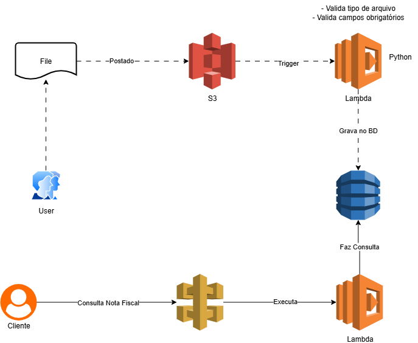
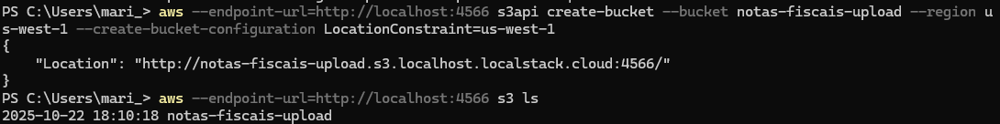
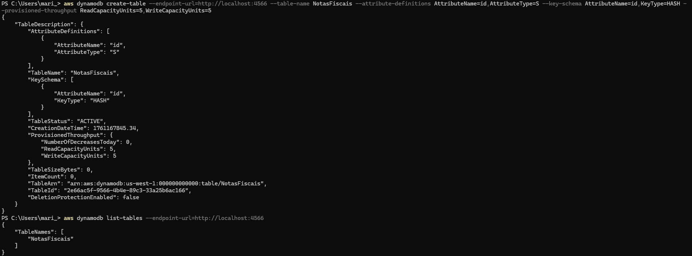
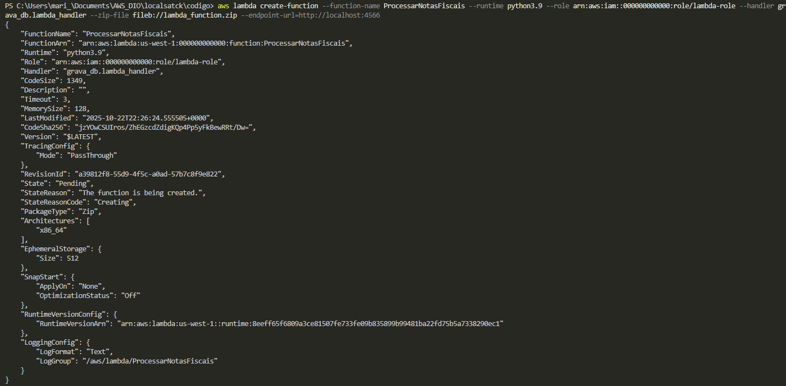
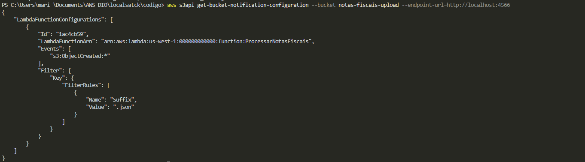
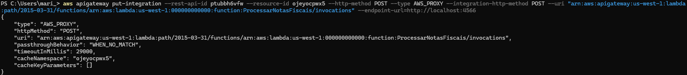
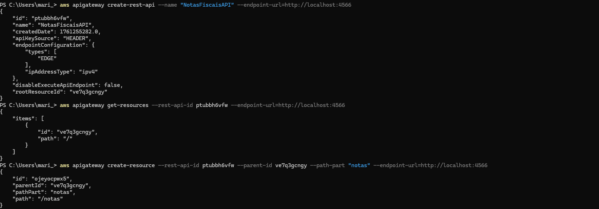
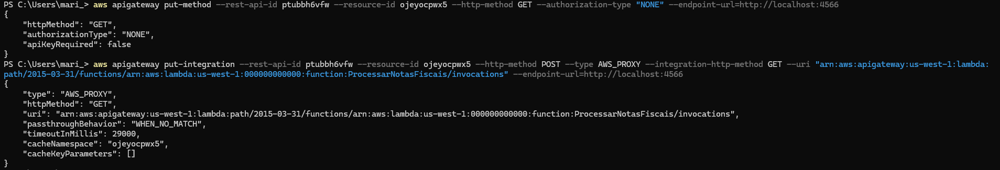
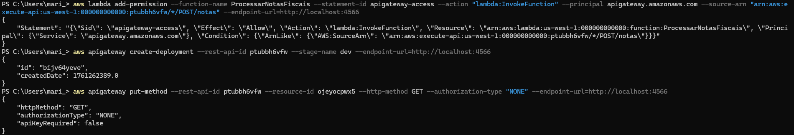

# 🧾 Sistema de Processamento de Notas Fiscais — AWS CloudFormation + LocalStack

Este projeto implementa uma **arquitetura serverless** simulando o ambiente AWS através do **LocalStack**, com o objetivo de automatizar o processamento e a consulta de notas fiscais.

Quando um arquivo JSON contendo informações de uma nota fiscal é enviado ao bucket S3, uma função **AWS Lambda** é acionada para validar os dados e gravá-los no **DynamoDB**.  
Além disso, uma API criada no **API Gateway** permite consultar as notas fiscais armazenadas.

---

## 🗂️ Estrutura do Repositório

```
AWS-CLOUDFORMATION-LOCALSTACK/
├── images/ # Diagramas e prints ilustrativos do projeto
│ ├── adicionar_permissao.png
│ ├── concede_permissao_e_implementa_api.png
│ ├── configura_metodo_http.png
│ ├── cria_API_e_recurso.png
│ ├── criacao_bucket.png
│ ├── criacao_dynamodb.png
│ ├── criacao_labda_function.png
│ ├── integra_metodo.png
│ ├── validar_notificacao.png
│ ├── DiagramaSistemaDeProcessamentoDeNotasFiscais.png
│
├── gerar_dados.py # Script para gerar JSONs de notas fiscais
├── grava_db.py # Função Lambda responsável por validar e gravar notas no DynamoDB
├── lambda_function.zip # Pacote da Lambda pronto para deploy
├── notas_fiscais_2025.json # Exemplo de arquivo de nota fiscal (input do S3)
├── notification_roles.json # Configuração das permissões e notificações do S3 → Lambda
├── README.md # (Você está aqui)
```

---

## 🧩 Arquitetura do Sistema



### Fluxo de funcionamento

1. 🗂 **Upload de arquivo (S3)**

   - O usuário envia um arquivo JSON (`notas_fiscais_2025.json`) para o bucket S3.
   - Esse bucket possui uma _notification configuration_ que aciona uma função Lambda.

2. ⚙️ **Lambda: ProcessarNotasFiscais**

   - Lê o conteúdo do JSON.
   - Valida campos obrigatórios (`id`, `cliente`, `valor`, `data_emissao`).
   - Em caso de sucesso, grava o registro no DynamoDB.
   - Em caso de erro, move o arquivo para uma pasta de erro no S3.

3. 💾 **DynamoDB: NotasFiscais**

   - Armazena as informações processadas das notas.
   - Cada item contém o `id` como chave primária.

4. 🌐 **API Gateway**

   - Exposição de endpoints REST para interação com as notas fiscais:
     - `POST /notas` → Insere novas notas.
     - `GET /notas?id=XYZ` → Consulta nota específica.

5. ⚡ **Lambda: ConsultaNotas**
   - Função acionada via API Gateway.
   - Realiza a leitura no DynamoDB e retorna o registro solicitado.

---

## 🧰 Tecnologias Utilizadas

| Componente          | Descrição                                               |
| ------------------- | ------------------------------------------------------- |
| **LocalStack**      | Emula serviços AWS localmente                           |
| **AWS S3**          | Armazenamento dos arquivos de notas fiscais             |
| **AWS Lambda**      | Funções responsáveis por processar e consultar os dados |
| **AWS DynamoDB**    | Banco de dados NoSQL para armazenar notas fiscais       |
| **AWS API Gateway** | Criação dos endpoints para consulta                     |
| **Python (boto3)**  | SDK utilizado para integração com os serviços AWS       |

---

## 🧩 Arquitetura do Sistema

A arquitetura geral é representada pelo diagrama abaixo:


---

## ⚙️ Etapas de Criação e Configuração

### 🪣 Criação do Bucket S3



### 🧱 Criação da Tabela DynamoDB



### ⚙️ Criação da Função Lambda



### 🔔 Validação da Notificação S3 → Lambda



### 🔗 Integração da Trigger S3 → Lambda



### 🌐 Criação da API Gateway



### ⚡ Configuração do Método HTTP



### 🧩 Permissão para a API Invocar a Lambda


### 🔄 Integração Final Método → Lambda



---
